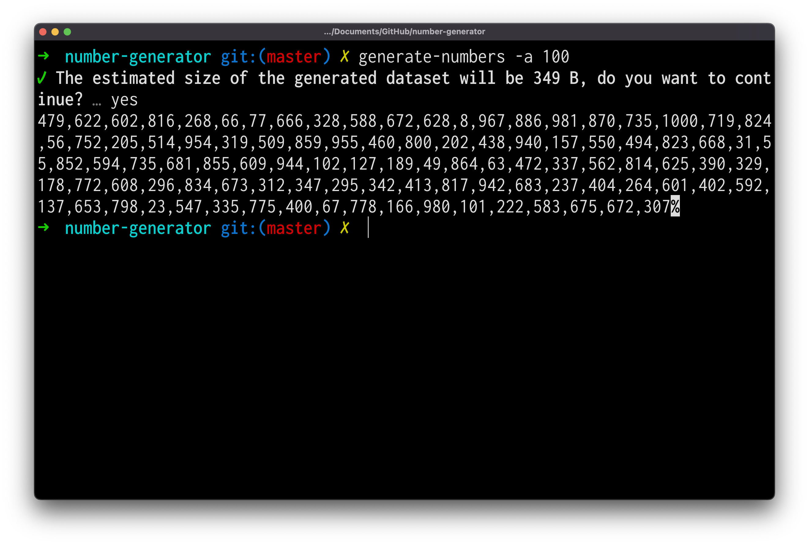
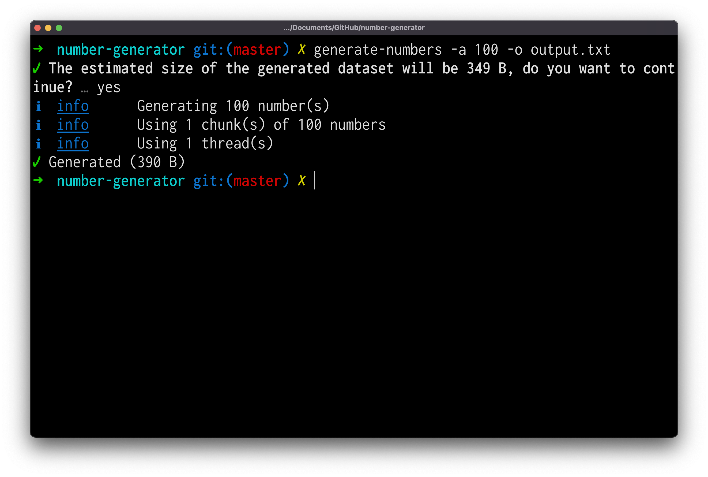
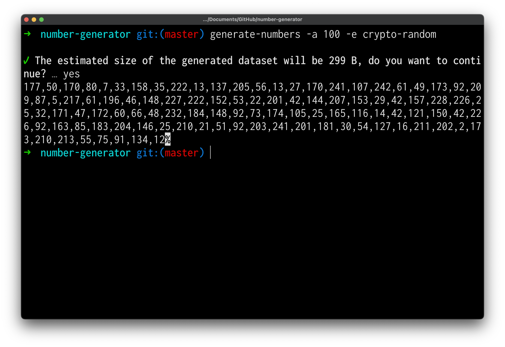
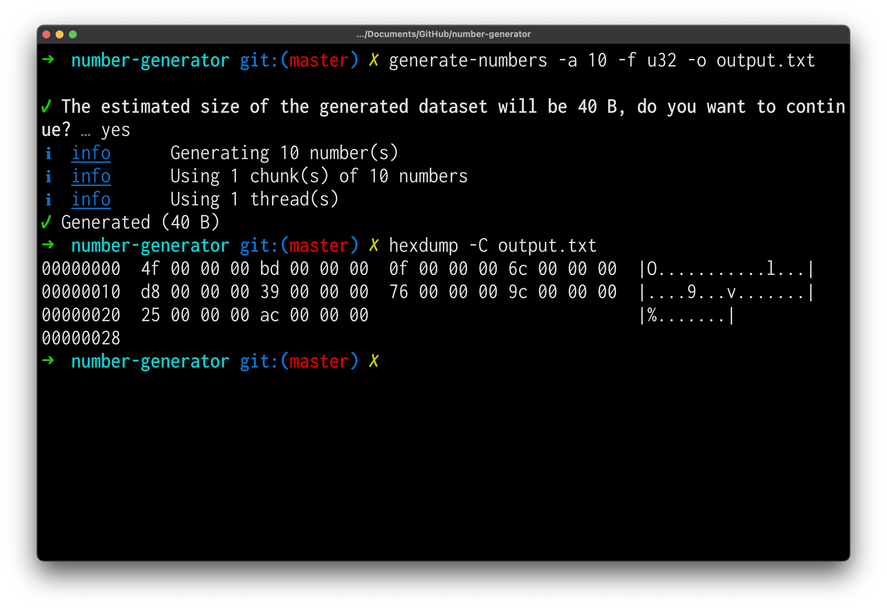

<br /><br /><br /><br />
<p align="center">
  
</p>
<br /><br />

# number-generator
> A multi-threaded generator allowing to generate a large dataset of random numbers.

[](https://app.travis-ci.com/HQarroum/number-generator)
[](https://www.codefactor.io/repository/github/hqarroum/number-generator)
[](https://deepsource.io/gh/HQarroum/number-generator/?ref=repository-badge)

Current version: **1.0.1**

## 📋 Table of content

- [Installation](#-install)
- [Description](#-description)
- [Usage](#usage)

## 🚀 Install

```bash
npm install --global generate-numbers
```

Once installed, you can verify that the package was successfully installed by running the following command.

```bash
$ generate-numbers --version
v1.0.0
```

Using `npx` you can invoke `generate-numbers` without having to explicitely install the package.

```bash
$ npx generate-numbers --version
v1.0.0
```

## 🔰 Description

This command-line tool aims to provide an easy way to rapidly generate a large dataset of random numbers. It provides users with the ability to choose how many numbers to create and in which interval (min and max numbers), and will automatically partition the generation process across multiple worker threads depending on the CPU threads available.

I wrote this tool in order to be able to rapidly generate a set of random numbers in different formats (e.g `textual`, `uint8`, `uint16`, `uint32` and `uint64`) to solve problems such as the [Terasort design problem](https://knaidu.gitbooks.io/problem-solving/content/design_problems/design_peta_and_tera_sort.html) and to experiment using  [Worker Threads](https://nodejs.org/api/worker_threads.html) in NodeJS.

> Note that this tool doesn't support parallelizing random number generation across multiple machines.

## 📘 Usage

### Generating random numbers

The `generate-numbers` tool provides a convenient way to create random numbers. By default, the generated numbers are written to the standard output and can optionally be written to a file.

```bash
# The below example will create 10 million random numbers.
generate-numbers --amount 10000000
```

> You will be prompted to validate the estimated size of the dataset to be generated, to avoid the prompt, you can use the `--yes` option.

<br />
<p align="center">
  
</p>

### Writing to a file

You can use `generate-numbers` to write the generated numbers to a file as well. Using this option will be much faster than using a shell redirection.

```bash
generate-numbers --amount 10000000 --output output.txt
```

<br />
<p align="center">
  
</p>

### Using different engines

Two random number generation engines are supported by this tool :

- `math-random` which uses the `Math.random()` Javascript API to generate random numbers. Note that `Math.random()` is [not a cryptographically-secure random number generator](https://security.stackexchange.com/questions/84906/predicting-math-random-numbers).
- `crypto-random` which uses the `Crypto` API to generate cryptographically strong pseudorandom integers. Note that using the `crypto-random` engine will be much slower than using the `math-random` engine but will use more entropy to generate the numbers.

<br />
<p align="center">
  
</p>

### Using different formats

When generating pseudorandom numbers, you can choose different output formats depending on your needs. Below is a table describing the supported output formats along with their characteristics.

Format | Min | Max | Description
------ | --- | --- | -----------
`text` |  −(2^53 − 1) | 2^53 − 1 | Displays numbers as comma-delimited ASCII numbers.
`u8`   |  0  | 255 | Displays numbers as binary 8-bit integers.
`u16`  |  0  | 65535 | Displays numbers as binary 16-bit integers.
`u32`  |  0  | 4294967295 | Displays numbers as binary 32-bit integers.
`u64`  |  0  | 2^53 − 1 | Displays numbers as binary 64-bit integers.

<br />
<p align="center">
  
</p>

### Parameters

- `-a, --amount <amount>` - The amount of numbers to generate
- `-c, --chunk-size <size>` - The size of the chunks to use when generating numbers (10000000 numbers by default)
- `-m, --min-number <min-number>` - The minimum possible random number to generate (0, by default)
- `-x, --max-number <max-number>` - The maximum possible random number to generate (1000, by default)
- `-t, --thread-count <count>` - The number of worker threads to use (set to the number of available CPU by default)
- `-o, --output <file>` - A path to a file to write the numbers to
- `-s, --stats-file <file>` - A path to a file to write the statistics about the generated chunks to
- `-b, --backend <backend>` - The generator backend to use (math-random or crypto-random)
- `-y, --yes` - Automatically answer positively to confirmation prompts
